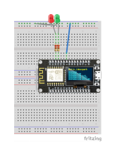

# Exercise 1: LED Basics and Web Control

## Learning Objectives

- Understand how breadboards work
- Learn LED basics and circuit design
- Master `digitalWrite()` function
- Build a simple web server for LED control
- Test circuits safely

## Breadboard Basics

### How Breadboards Work

A breadboard is a prototyping tool that allows you to connect components without soldering:

```
     a  b  c  d  e    f  g  h  i  j
1  [•] [•] [•] [•] [•] [•] [•] [•] [•] [•]
2  [•] [•] [•] [•] [•] [•] [•] [•] [•] [•]
3  [•] [•] [•] [•] [•] [•] [•] [•] [•] [•]
   ... (continues for 30 rows)

Power Rails:
+ [•] [•] [•] [•] [•] [•] [•] [•] [•] [•]
- [•] [•] [•] [•] [•] [•] [•] [•] [•] [•]
```

**Key Points:**
- Each column (a-e) is connected vertically. Points between 1-3 are connected.
- Power rails (+ and -) run horizontally
- No connection between rows

## LED Basics

### What is an LED?

Light Emitting Diode (LED) is a semiconductor device that emits light when current flows through it.

**Important Properties:**
- **Polarity**: LEDs have positive (anode) and negative (cathode) terminals
- **Current**: LEDs need current limiting (resistor)
- **Voltage**: Typical forward voltage is 1.8V-3.3V

### LED Identification

```
    Anode (+)     Cathode (-)
       |              |
       |              |
    [LED]          [LED]
       |              |
   Longer leg    Shorter leg
   (positive)    (negative)
```

## Circuit Design

### LED Circuit Schematic

<p align="center">
  
</p>

```
ESP8266 D2 ----[330Ω]----[LED]----GND
```

**Components:**
- ESP8266 GPIO pin (D2)
- 220Ω resistor (current limiting)
- LED (Red or Green)
- Ground connection

### Breadboard Layout

```
ESP8266 Board:
    D2 ----[220Ω Resistor]----[LED]----GND
```

**Wiring Steps:**
1. Connect ESP8266 GND to breadboard negative rail
2. Connect ESP8266 3.3V to breadboard positive rail
3. Insert 220Ω resistor from D2 pin to breadboard row
4. Insert LED (longer leg to resistor, shorter leg to GND rail)

## Arduino Functions

### `digitalWrite()` Function

```cpp
digitalWrite(pin, value);
```

**Parameters:**
- `pin`: GPIO pin number (e.g., D2, D3)
- `value`: HIGH (3.3V) or LOW (0V)

**Examples:**
```cpp
digitalWrite(D2, HIGH);  // Turn LED on
digitalWrite(D2, LOW);   // Turn LED off
```

### `pinMode()` Function

```cpp
pinMode(pin, mode);
```

**Modes:**
- `OUTPUT`: Pin can drive current (for LEDs)
- `INPUT`: Pin reads voltage levels
- `INPUT_PULLUP`: Pin reads with internal pull-up resistor

**Example:**
```cpp
pinMode(D2, OUTPUT);  // Set D2 as output for LED
```

## Testing Your Circuit

### Safety First!

**Before connecting power:**
1. Double-check all connections
2. Verify LED polarity (longer leg = positive)
3. Ensure resistor is in series with LED
4. Check for short circuits
5. Ask me to review the wiring

### Basic LED Test

```cpp
void setup() {
  pinMode(D2, OUTPUT);
  Serial.begin(115200);
  Serial.println("LED Test Starting...");
}

void loop() {
  digitalWrite(D2, HIGH);
  Serial.println("LED ON");
  delay(1000);
  
  digitalWrite(D2, LOW);
  Serial.println("LED OFF");
  delay(1000);
}
```

### Expected Results

- LED blinks every 2 seconds
- Serial monitor shows "LED ON" and "LED OFF"
- No smoke or overheating! Or a funny smell!

## Web Server Setup

### WiFi Connection

```cpp
#include <ESP8266WiFi.h>

void setupWiFi() {
  WiFi.begin("YourWiFi", "password");
  
  while (WiFi.status() != WL_CONNECTED) {
    delay(500);
    Serial.print(".");
  }
  
  Serial.println("WiFi Connected!");
  Serial.print("IP Address: ");
  Serial.println(WiFi.localIP());
}
```

### Simple Web Server

```cpp
#include <ESP8266WebServer.h>

ESP8266WebServer server(80);

void setup() {
  pinMode(D2, OUTPUT);
  setupWiFi();
  
  server.on("/", handleRoot);
  server.on("/led/on", handleLEDOn);
  server.on("/led/off", handleLEDOff);
  
  server.begin();
  Serial.println("Web server started");
}

void loop() {
  server.handleClient();
}

void handleRoot() {
  server.send(200, "text/html", 
    "<h1>LED Control</h1>"
    "<a href='/led/on'>Turn LED ON</a><br>"
    "<a href='/led/off'>Turn LED OFF</a>"
  );
}

void handleLEDOn() {
  digitalWrite(D2, HIGH);
  server.send(200, "text/plain", "LED ON");
}

void handleLEDOff() {
  digitalWrite(D2, LOW);
  server.send(200, "text/plain", "LED OFF");
}
```

## Testing Web Control

1. Upload the code to your ESP8266
2. Open Serial Monitor (115200 baud)
3. Note the IP address (e.g., 192.168.1.100)
4. Open browser and go to `http://192.168.1.100`
5. Click links to control LED

## Troubleshooting

### LED Not Working
- Check polarity (longer leg = positive)
- Verify resistor connection
- Test with multimeter
- Check GPIO pin assignment

### Web Server Not Accessible
- Verify WiFi connection
- Check IP address in Serial Monitor
- Ensure same network as computer
- Try different browser

### Serial Monitor Issues
- Baud rate must be 115200
- Check USB cable connection
- Verify port selection

## Next Steps

- Read [exercise2.md](exercise2.md) for REST API development
