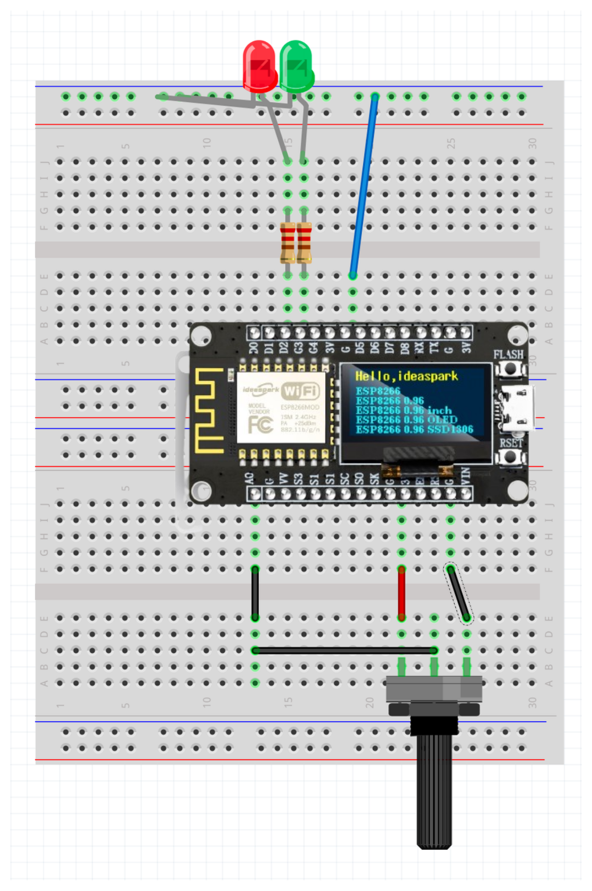

# Lecture 2: Potentiometer Control and Real-Time Web Updates

## Learning Objectives

- Understand how potentiometers work as variable resistors
- `analogRead()` function and ADC conversion
- WebSocket communication for real-time updates
- Build a combined LED + potentiometer web interface
- Test circuits with multimeter for voltage verification

## Potentiometer Basics

### What is a Potentiometer?

A potentiometer (pot) is a three-terminal variable resistor that acts as a voltage divider. It's commonly used for volume controls, brightness adjustments, and sensor inputs.

**Key Properties:**
- **Resistance**: Variable from 0Ω to maximum value (1kΩ in our case)
- **Terminals**: Three pins - two outer terminals and one wiper (center)
- **Voltage Divider**: Outputs proportional voltage based on wiper position

### Potentiometer Identification

```
    Terminal 1     Wiper     Terminal 2
        |           |           |
        |           |           |
    [POT]--------[POT]--------[POT]
        |           |           |
      3.3V        A0 Pin      GND
```

**Terminal Functions:**
- **Terminal 1**: Connect to 3.3V (high voltage)
- **Wiper (Center)**: Connect to A0 (analog input)
- **Terminal 2**: Connect to GND (low voltage)

## Circuit Design



### Potentiometer Circuit Schematic

```
ESP8266 Board:
    3.3V ----[1kΩ Potentiometer]----GND
              |
              A0 (ADC Input)
```

**Components:**
- ESP8266 3.3V power pin
- 1kΩ potentiometer
- ESP8266 A0 pin (analog input)
- Ground connection


**Wiring Steps:**
1. Connect ESP8266 3.3V to breadboard positive rail
2. Connect ESP8266 GND to breadboard negative rail
3. Insert potentiometer across positive and negative rails
4. Connect potentiometer wiper (center pin) to A0 pin
5. Verify connections with multimeter

## Arduino Functions

### `analogRead()` Function

```cpp
int value = analogRead(pin);
```

**Parameters:**
- `pin`: Analog input pin (A0 on ESP8266)

**Return Value:**
- Integer from 0 to 1023
- 0 = 0V input
- 1023 = 3.3V input
- Linear mapping: `voltage = (value / 1023.0) * 3.3`

**Examples:**
```cpp
int sensorValue = analogRead(A0);           // Read raw ADC value
float voltage = (sensorValue / 1023.0) * 3.3;  // Convert to voltage
Serial.println("ADC: " + String(sensorValue) + ", Voltage: " + String(voltage));
```

### ADC (Analog-to-Digital Converter)

The ESP8266 has a 10-bit ADC that converts analog voltage to digital values:

```
Voltage Range: 0V - 3.3V
Digital Range: 0 - 1023
Resolution: 3.3V / 1024 = 0.0032V per step
```

**Important Notes:**
- ESP8266 ADC is not perfectly linear
- Maximum input voltage is 3.3V (don't exceed!)
- Use external voltage divider for higher voltages

## Testing Your Circuit

### Safety First!

**Before connecting power:**
1. Double-check all connections
2. Verify potentiometer orientation
3. Ensure no short circuits
4. Check voltage with multimeter
5. Ask me to review the wiring

### Basic Potentiometer Test

```cpp
void setup() {
  Serial.begin(115200);
  Serial.println("Potentiometer Test Starting...");
}

void loop() {
  int sensorValue = analogRead(A0);
  float voltage = (sensorValue / 1023.0) * 3.3;
  
  Serial.print("ADC: ");
  Serial.print(sensorValue);
  Serial.print(", Voltage: ");
  Serial.println(voltage);
  
  delay(100);
}
```

### Multimeter Verification

**Test Points:**
1. **Power Supply**: Measure 3.3V between 3.3V pin and GND
2. **Potentiometer Input**: Measure voltage at A0 pin (should vary 0V-3.3V)
3. **Resistance**: Measure resistance across potentiometer terminals

**Expected Results:**
- ADC values: 0-1023 range
- Voltage: 0V-3.3V range
- Smooth changes when turning potentiometer
- No erratic readings or noise

## WiFi Access Point Setup

### Creating a Passwordless Network

Instead of connecting to an existing WiFi network, we'll create our own Access Point (AP) that students can connect to directly:

```cpp
#include <ESP8266WiFi.h>

void setupWiFiAP() {
  // Create Access Point with custom name
  WiFi.mode(WIFI_AP);
  WiFi.softAP("IoT-Workshop", "");  // No password (empty string)
  
  Serial.println("Access Point created!");
  Serial.print("AP IP address: ");
  Serial.println(WiFi.softAPIP());
  Serial.println("Connect to: IoT-Workshop");
  Serial.println("No password required!");
}
```

**Benefits of Access Point Mode:**
- **No Router Required**: Students connect directly to ESP8266
- **Passwordless**: No need to share WiFi credentials
- **Workshop Friendly**: Each team has their own network
- **Reliable**: No dependency on venue WiFi

## WebSocket Server Setup

### WebSocket Library

```cpp
#include <WebSocketsServer.h>

WebSocketsServer webSocket = WebSocketsServer(81);
```

### WebSocket Event Handler

```cpp
void webSocketEvent(uint8_t num, WStype_t type, uint8_t * payload, size_t length) {
  switch(type) {
    case WStype_DISCONNECTED:
      Serial.printf("[%u] Disconnected!\n", num);
      break;
      
    case WStype_CONNECTED:
      Serial.printf("[%u] Connected from %s\n", num, payload);
      break;
      
    case WStype_TEXT:
      // Handle incoming messages
      break;
  }
}
```

### Combined LED + Potentiometer Server

```cpp
#include <ESP8266WiFi.h>
#include <ESP8266WebServer.h>
#include <WebSocketsServer.h>

ESP8266WebServer server(80);
WebSocketsServer webSocket = WebSocketsServer(81);

int redLEDPin = D2;
int greenLEDPin = D3;
int potPin = A0;

void setup() {
  Serial.begin(115200);
  
  // Setup pins
  pinMode(redLEDPin, OUTPUT);
  pinMode(greenLEDPin, OUTPUT);
  
  // Setup WiFi Access Point
  setupWiFiAP();
  
  // Setup web server
  server.on("/", handleRoot);
  server.on("/api/led/red/toggle", handleRedLEDToggle);
  server.on("/api/led/green/toggle", handleGreenLEDToggle);
  server.on("/api/pot/read", handlePotRead);
  
  server.begin();
  
  // Setup WebSocket
  webSocket.begin();
  webSocket.onEvent(webSocketEvent);
  
  Serial.println("Web server and WebSocket started");
}

void loop() {
  server.handleClient();
  webSocket.loop();
  
  // Send potentiometer data every 100ms
  static unsigned long lastUpdate = 0;
  if (millis() - lastUpdate > 100) {
    sendPotData();
    lastUpdate = millis();
  }
}

void sendPotData() {
  int potValue = analogRead(potPin);
  String json = "{\"pot\": " + String(potValue) + "}";
  webSocket.broadcastTXT(json);
}
```

## Web Interface

### HTML Page with WebSocket

```html
<!DOCTYPE html>
<html>
<head>
    <title>LED + Potentiometer Control</title>
    <style>
        body {
            font-family: Arial, sans-serif;
            text-align: center;
            padding: 20px;
            transition: background-color 0.3s ease;
        }
        .controls {
            margin: 20px;
        }
        button {
            padding: 10px 20px;
            margin: 10px;
            font-size: 16px;
            border: none;
            border-radius: 5px;
            cursor: pointer;
        }
        .red-btn { background-color: #ff4444; color: white; }
        .green-btn { background-color: #44ff44; color: black; }
        .status {
            margin: 20px;
            padding: 10px;
            background-color: #f0f0f0;
            border-radius: 5px;
        }
    </style>
</head>
<body>
    <h1>IoT Control Panel</h1>
    
    <div class="controls">
        <button class="red-btn" onclick="toggleRedLED()">Toggle Red LED</button>
        <button class="green-btn" onclick="toggleGreenLED()">Toggle Green LED</button>
    </div>
    
    <div class="status">
        <h3>Potentiometer Value</h3>
        <div id="potValue">Reading...</div>
        <div id="voltage">Voltage: -- V</div>
    </div>

    <script>
        // WebSocket connection
        const ws = new WebSocket('ws://' + location.hostname + ':81/');
        
        ws.onopen = function() {
            console.log('WebSocket connected');
        };
        
        ws.onmessage = function(event) {
            const data = JSON.parse(event.data);
            updatePotDisplay(data.pot);
        };
        
        function updatePotDisplay(potValue) {
            document.getElementById('potValue').textContent = potValue;
            
            // Convert to voltage
            const voltage = (potValue / 1023.0) * 3.3;
            document.getElementById('voltage').textContent = 
                'Voltage: ' + voltage.toFixed(2) + ' V';
            
            // Change background color (Red to Blue gradient)
            const red = Math.floor((potValue / 1023.0) * 255);
            const blue = Math.floor(255 - (potValue / 1023.0) * 255);
            document.body.style.backgroundColor = 
                `rgb(${red}, 0, ${blue})`;
        }
        
        function toggleRedLED() {
            fetch('/api/led/red/toggle')
                .then(response => response.text())
                .then(data => console.log(data));
        }
        
        function toggleGreenLED() {
            fetch('/api/led/green/toggle')
                .then(response => response.text())
                .then(data => console.log(data));
        }
    </script>
</body>
</html>
```

### Web Server Handlers

```cpp
void handleRoot() {
  String html = "<!DOCTYPE html><html><head><title>LED + Potentiometer Control</title>";
  html += "<style>body{font-family:Arial,sans-serif;text-align:center;padding:20px;transition:background-color 0.3s ease;}";
  html += ".controls{margin:20px;}button{padding:10px 20px;margin:10px;font-size:16px;border:none;border-radius:5px;cursor:pointer;}";
  html += ".red-btn{background-color:#ff4444;color:white;}.green-btn{background-color:#44ff44;color:black;}";
  html += ".status{margin:20px;padding:10px;background-color:#f0f0f0;border-radius:5px;}</style></head>";
  html += "<body><h1>IoT Control Panel</h1><div class='controls'>";
  html += "<button class='red-btn' onclick='toggleRedLED()'>Toggle Red LED</button>";
  html += "<button class='green-btn' onclick='toggleGreenLED()'>Toggle Green LED</button>";
  html += "</div><div class='status'><h3>Potentiometer Value</h3>";
  html += "<div id='potValue'>Reading...</div><div id='voltage'>Voltage: -- V</div></div>";
  html += "<script>const ws=new WebSocket('ws://'+location.hostname+':81/');";
  html += "ws.onopen=function(){console.log('WebSocket connected');};";
  html += "ws.onmessage=function(event){const data=JSON.parse(event.data);updatePotDisplay(data.pot);};";
  html += "function updatePotDisplay(potValue){document.getElementById('potValue').textContent=potValue;";
  html += "const voltage=(potValue/1023.0)*3.3;document.getElementById('voltage').textContent='Voltage: '+voltage.toFixed(2)+' V';";
  html += "const red=Math.floor((potValue/1023.0)*255);const blue=Math.floor(255-(potValue/1023.0)*255);";
  html += "document.body.style.backgroundColor='rgb('+red+',0,'+blue+')';}";
  html += "function toggleRedLED(){fetch('/api/led/red/toggle').then(response=>response.text()).then(data=>console.log(data));}";
  html += "function toggleGreenLED(){fetch('/api/led/green/toggle').then(response=>response.text()).then(data=>console.log(data));}";
  html += "</script></body></html>";
  
  server.send(200, "text/html", html);
}

void handlePotRead() {
  int potValue = analogRead(potPin);
  float voltage = (potValue / 1023.0) * 3.3;
  
  String json = "{\"pot\": " + String(potValue) + 
                ", \"voltage\": " + String(voltage) + "}";
  server.send(200, "application/json", json);
}
```

## Testing Real-Time Updates

### Step-by-Step Testing

1. **Upload the code** to your ESP8266
2. **Open Serial Monitor** (115200 baud)
3. **Look for Access Point creation**:
   ```
   Access Point created!
   AP IP address: 192.168.4.1
   Connect to: IoT-Workshop
   No password required!
   ```
4. **Connect your device** to WiFi network "IoT-Workshop" (no password)
5. **Open browser** and go to `http://192.168.4.1`
6. **Turn the potentiometer** and watch:
   - Background color changes dynamically
   - Potentiometer value updates in real-time
   - Animated needle rotates smoothly
7. **Test LED controls** while potentiometer is running

### Workshop Setup Tips

**For Instructors:**
- Each team's ESP8266 creates its own "IoT-Workshop" network
- Students connect to their team's specific device
- No need to share venue WiFi credentials
- Each team works independently

**For Students:**
- Look for "IoT-Workshop" in your WiFi settings
- Connect without entering a password
- Use the IP address shown in Serial Monitor
- If multiple teams, connect to your team's specific device

## Troubleshooting

### Potentiometer Not Working
- Check all three connections (3.3V, A0, GND)
- Verify potentiometer orientation
- Test with multimeter for voltage changes
- Check for loose breadboard connections

### Access Point Connection Issues
- Check if "IoT-Workshop" network appears in WiFi settings
- Ensure ESP8266 is powered on and code uploaded
- Try disconnecting and reconnecting to the network
- Check Serial Monitor for "Access Point created!" message
- Verify IP address is 192.168.4.1

### WebSocket Connection Failed
- Verify WebSocket port 81 is open
- Check browser console for errors
- Ensure connected to "IoT-Workshop" network
- Try refreshing the page
- Check if multiple devices are connected to same ESP8266

### Erratic Readings
- Check for loose connections
- Verify 3.3V power supply stability
- Test potentiometer with multimeter
- Add small capacitor for noise filtering

### Background Color Not Changing
- Check browser JavaScript console
- Verify WebSocket messages are received
- Test with different browsers
- Check JSON parsing

## WebSocket vs Other Methods

### WebSocket Advantages
- **Real-time**: Instant updates without polling
- **Efficient**: Low overhead, bidirectional communication
- **Reliable**: Built-in connection management
- **Modern**: Standard web technology

### Alternative Methods
- **Polling**: `setInterval()` with fetch requests (simpler but less efficient)
- **Server-Sent Events**: One-way real-time updates
- **Long Polling**: Keep connection open for updates

## Next Steps

- Read [api-spec.md](api-spec.md) for complete API documentation
- Try examples in `/examples` directory
- Prepare for dashboard development challenge
- Experiment with different sensor types
- Learn about data logging and visualization
